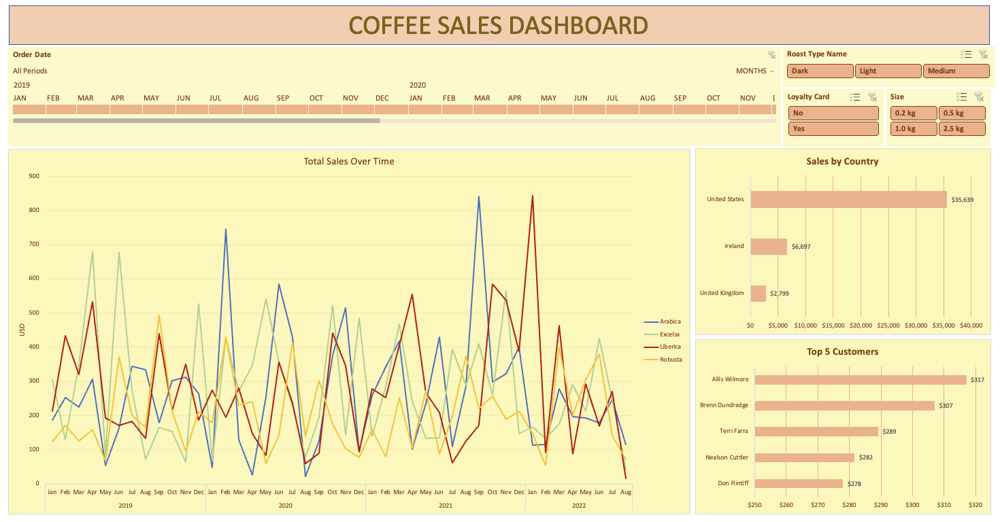

# Coffee Orders Data
Coffee Orders Data Analysis with Excel

- XLOOKUP
- Multiple IF functions
- Date formatting
- Number formatting
- Check for duplicates
- Convert range to table
- Pivot table, pivot chart + formatting
- Insert timeline
- Insert slicers
- Updating pivot table data source, refresh
- built dashboard

https://www.youtube.com/watch?v=m13o5aqeCbM

